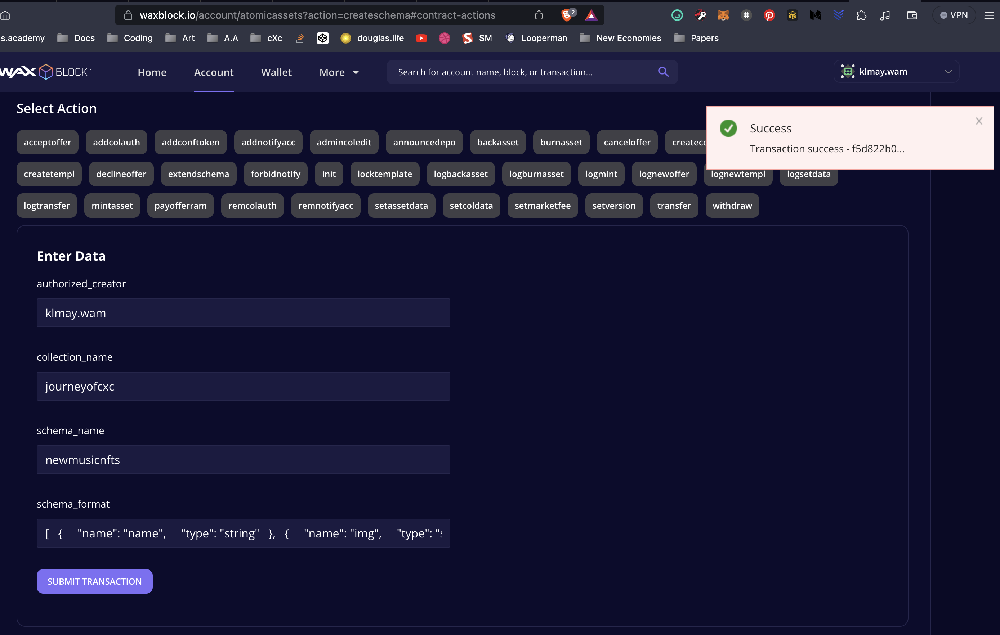

# cXc Music NFT Standard 🎸

  Version: 1.0.0
  Total Fields: 24
  by: [cXc.world](https://cxc.world/)

## Watch the [Instructional Video](https://www.youtube.com/watch?v=k0vt8v5iIn4) on creating your Music NFT on WAX 

> There's also written instructions below

# About this standard
The cXc Music NFT Standard works with the [Atomichub](https://wax.atomichub.io/) and [Neftyblocks](https://neftyblocks.com/) to help any individual, collection, or application to make their own music NFT project. 

This standard is a schema (more recently called "category" on atomichub.io) which allows you to make templates for Music NFTs.

The benefits of using this schema include forward compatibility (Geotags) getting artists plays that pay with traditional platform players, credits, links, and more.

**There's no coding required.** But you'll see the code below ready for changes if you'd rather exclude traditional players, or add extra audio fields. You can even [make a music NFT from your phone.](https://www.youtube.com/watch?v=k0vt8v5iIn4)

This Schema exists within Atomic Asset's [NFT standard](https://github.com/pinknetworkx/atomicassets-contract) on the [atomicassets contract](https://wax.bloks.io/account/atomicassets).

Feel free to use or modify this schema for any purposes in accordance with the [license](LICENSE).

## Check out our NFT collection using this standard [here](https://drops.cxc.world/)


# Summary 🗞️
This standard includes:  

Name of the NFT (Can be different than track title)

One audio field  
One video field  
Four images [Main, Back, Collection and Promo]   
One clip that can be anything used for a preview or extra media field of any type

Title [If different than name]   
Album name   
Track # [If it's just one track]   

Any number of custom credits   
Any number of custom platform links   

ISO Country code  
Readable locale   
Geotag as GeoJson Point   

License   
Rarity   


# Technical Summary ⚙️
All media fields use IPFS. Fields labeled `image` can be uploaded through Atomichub.com. [Pinata](https://www.pinata.cloud/) is an option to host files with IPFD with a free tier.  

All other info fields are strings (except "track" is int64)  

`year` is also a string in case there's a more accurate date desired or a range of years.

*Rarity* is filterable on many NFT marketplaces

License is for codes like "CC-BY", or can be used to declare a priviledge granted upon receiving NFT. 


## Geo 🌍
ISO country codes should follow ISO 3166-1 alpha-3 (USA, COL, etc)

Locale string intended to be used in this format "City, County, State" or corresponding values for a given locality

geotag is a GeoJson point stored as a string


| Field name | Type | Description | 
| :----:  | :----: | :---- |
| name | string | NFT name |  
| img | image | Primary image / Cover image |  
| audio | audio | Audio file IPFS hash |  
| video | video | Music video file IPFS hash |  
| clip | video | Additional video file IPFS hash |  
| backimg | image | Back cover of album / single |  
| promo | ipfs | Extra image or video for promo poster, QR code, etc |  
| collectionimg | image | Extra image for Collection, optional |  
| artist | string | The artist, if you prefer a separate field to putting with other credits | 
| title | string | The actual title of the track |  
| album | string | Title of the album |  
| track | int64 | Number of the track on the album |  
| released | string | Date first released |  
| about | string | Description field with info about |  
| credits | string | Array of song credits |  
| youtube | string | Youtube URL |  
| spotify | string | Spotify URL |  
| soundcloud | string | Soundcloud URL |  
| platforms | string | A list of all platforms the music can be found, and socials if desired |  
| nation | string | Three-letter ISO (USA, BRA, AUS, etc) |  
| locale | string | Local locales (State, County, City in USA) |  
| geotag | string | GeoJSON Point stored as string, format "lat,lng" (e.g., "37.7749,-122.4194"), or a "[lat,lng]" coordinate array (e.g., "[37.7749, -122.4194]") |  
| license | string | Declare license, (Copyright, CC0, MIT, etc) |  
| rarity | string | How scarce is this NFT? Abundant Common Uncommon Rare Epic Mythic Unique |  


# To use the cXc Music NFT Standard 
First, you'll need a collection. 

> If you're new, follow [this guide](https://nftnewstoday.com/2023/04/24/the-ultimate-guide-to-atomichub-nfts-trading-and-more/) for more info.

To add a Music NFT schema to your collection, you may: 

1) Manually re-create the schema from the UI (Remember schema is called 'category' on atomichub) by adding each field in the table above. This is 'the long way'

or, do it almost instantly by: 

2) Copy the code below using the copy icon in the top-right of the code. Paste the following array into the `idata` field using the Atomic Assets [createschema](https://waxblock.io/account/atomicassets?action=createschema#contract-actions) action to create your own schema on Atomic Assets, and then create template from the schema for each NFT you release via Atomichub or Neftyblocks. 




> ℹ️  Important  

Using this schema does NOT mean that each template (or NFT) must have every field filled, but you can only choose from fields in your future templates. You may add fields to the schema later, but not remove them. New fields will appear at the end (ugly), thus, best to modify this standard to your needs before deploying.


# cXc Music Schema 🎸 
> Merged with Simple version (This is the Simple Version)
> Works with Atomichub UI out of the box. You can even avoid touching this code by using Create Schema on atomichub to replicate. 

```javascript
[
  {
    "name": "name",
    "type": "string"
  },
  {
    "name": "img",
    "type": "string"
  },
  {
    "name": "audio",
    "type": "ipfs"
  },
  {
    "name": "video",
    "type": "ipfs"
  },
  {
    "name": "clip",
    "type": "ipfs"
  },
  {
    "name": "backimg",
    "type": "image"
  },
  {
    "name": "promo",
    "type": "image"
  },
  {
    "name": "collectionimg",
    "type": "image"
  },
  {
    "name": "artist",
    "type": "string"
  },
  {
    "name": "title",
    "type": "string"
  },
  {
    "name": "album",
    "type": "string"
  },
  {
    "name": "track",
    "type": "int64"
  },
  {
    "name": "released",
    "type": "string"
  },
  {
    "name": "about",
    "type": "string"
  },
  {
    "name": "credits",
    "type": "string"
  },
  {
    "name": "youtube",
    "type": "string"
  },
  {
    "name": "spotify",
    "type": "string"
  },
  {
    "name": "soundcloud",
    "type": "string"
  },
  {
    "name": "platforms",
    "type": "string"
  },
  {
    "name": "nation",
    "type": "string"
  },
  {
    "name": "locale",
    "type": "string"
  },
  {
    "name": "geotag",
    "type": "string"
  },
  {
    "name": "license",
    "type": "string"
  },
  {
    "name": "rarity",
    "type": "string"
  }
]
```


# Create a Template  🛠️ 🖼️. 
Once you have your schema in place, use it to drop your own Music NFTs using tools like [Atomichub](https://wax.atomichub.io/) and [Neftyblocks](https://neftyblocks.com/).


# Modify this schema  🛠️

The power is in your hands! You can add, remove, or change fields when making your own schema.

Ideas:

**Artist** - If you'd rather have your name here than in credits   
**Multiple Audio fields** - Duplicate the audio fields to include all songs on an album (DYOR on marketplace support)   
**Metadata** - Add custom metadata like the key, BPM, time, whatever you want   

If you'd rather include all of your links in the Platform field, you can remove the Spotify, Soundcloud, and Youtube field. 

Removing Youtube will also disable Youtube player from showing up on Atomichub and likely other marketplaces.


# Power of the Schema ✨ 🧙‍♂️
Using this template ensures maximum forward-compatibility with [music.cXc.world](https://music.cxc.world)

There is no magical benefit (yet) of using this standard, just practical ones. Youtube plays can bring extra revenue, as will the links to other players. You may credit all involved, and geographic data opens up new use cases for your NFT.  

In the future it's possible a mapp / dapp (like cXc) to allow users to register their own schemas that adhere to this standard, creating a Music-NFT exclusive platform that doesn't rely on accounts or collection names alone. 


# Evolution of the Schema 🚀 🛸

This schema will grow and evolve. Feel free to open issues on this repo with your suggestions.  

If you translate to another blockchain or NFT standard, please send a pull request adding a file named <chain>.md in the main directory containing the code needed to deploy, or open an issue with the code and I can update the repo if you prefer. 

# Mini Change Log

## 1.0.0
Changed `year` to `released`
Changed types to better work with atomichub's UI
Improved explanation + added image


## 0.1.4
Added Additional `clip` and img fields
Changed `promo` description to suggest video + image 
Merged Simple version, made Simple the only option. To use old version, change string to string[] and use. This isn't recommended as there's little benefit and it's not working well through the Atomichub website

## 0.1.3
Added `artist`, `year`, and `collectionimg`

## 0.1.2
Added `rarity` and `license`

## 0.1.1
Added `track` and `album`


 <p align="center"> ~ Created with 💜  by <a href="https://cxc.world/f/nft" alt="cXc.world Music Mapp">cXc.world</a> ~
 <br />

Improvements to this standard were made possible by [Wax Labs](https://labs.wax.io/) </p>
